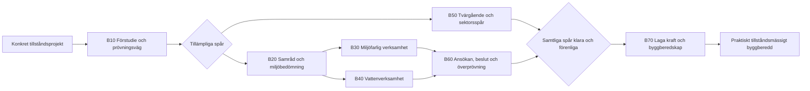

# Artefakt B – Processkarta + nodordbok

**Version:** 0.9  
**Rättsligt brytdatum:** 2026-08-20  
**Status:** Sak- och strukturgranskad v0.9

## Leveransens funktion

Artefakten beskriver en sammanhållen process för **Sverige AB** från konkret tillståndsförberedelse till laga kraft och praktisk tillståndsmässig byggberedskap. Delprocesserna är villkorsstyrda och kan löpa parallellt. Kartan är inte ett enskilt bolags process och innehåller inte företagsspecifik processdata.

Processkartan är uppdelad i åtta tekniska diagram eftersom Cardinal Core använder högst åtta diagram i processkontexten och högst 40 noder per diagram. De åtta diagrammen är **en logisk process**, sammanbundna med fälten `handoffFrom` och `handoffTo`.

## Processarkitektur

| Diagram | Innehåll | Noder | Kanter |
|---|---|---:|---:|
| B00 | Sverige AB: masterprocess | 11 | 15 |
| B10 | Förstudie och prövningsväg | 14 | 13 |
| B20 | Samråd och miljöbedömning | 14 | 16 |
| B30 | Miljöfarlig verksamhet | 25 | 29 |
| B40 | Vattenverksamhet | 35 | 44 |
| B50 | Tvärgående och sektorsspecifika spår | 40 | 57 |
| B60 | Ansökan, beslut och överprövning | 31 | 42 |
| B70 | Laga kraft och byggberedskap | 17 | 22 |

Totalt: **187 noder** och **238 kanter**.

## Hur filerna används

- **Artefakt_B_processkarta_import.json** importeras som en Cardinal-process-export. Den innehåller alla åtta diagram, noder, kanter och metadata.
- **Artefakt_B_kallregister.csv** samlar de rättsliga och vägledande källor som anges på noderna.
- Nodordboken ligger inbäddad i `Artefakt_B_processkarta_import.json` och ett riskmappbart läsutdrag byggs till `Artefakt_C_Riskregister/_build/mappable_nodes.json`.
- Struktur- och sakregressioner finns i `Artefakt_C_Riskregister/mcp-server/test/`.

Risker ska mappas till **detaljnoder i B10–B70**, inte till B00:s översiktsnoder. Masterdiagrammet har därför `riskMappingAllowed=false` på samtliga noder. Handoffs och rena slutnoder har också stängts för riskmappning där de endast representerar teknisk navigering.

## Rättslig baslinje och scenarier

S0 är den faktiskt gällande ordningen per 2026-08-20. SFS 2026:400, som trädde i kraft 1 juli 2026, ingår därför. Den beslutade Miljöprövningsmyndigheten träder i kraft senare och har **inte** byggts in i S0-flödet.

På berörda noder finns i stället `s1Delta` och scenariotaggar. S1 betyder den fullt fungerande men endast **beslutade initiala** myndighetsmodellen: tidigare MPD-ärenden flyttas till Miljöprövningsmyndigheten, medan församråd/BMP/avgränsning ligger kvar hos länsstyrelsen och A-verksamheter samt domstolsprövad vattenverksamhet ligger kvar hos MMD. S2 ska senare lägga New Republics fullt implementerade kontroller ovanpå samma process.

Beslutade men ännu inte ikraftträdda ändringar hålls versionsskilda från S0. Bevakningspunkter är bl.a. SFS 2026:1441 (1 september 2026), SFS 2026:1504 (1 november 2026), SFS 2026:1238 (1 januari 2027) samt SFS 2026:1442–1444 (1 juli 2027).

## Avgränsningar

Artefakten slutar vid praktisk tillståndsmässig byggberedskap. Drift, slutbesked, löpande tillsyn, upphandling, finansiering och kommersiella investeringsbeslut ligger utanför. Prospektering före konkret gruvtillståndsförberedelse och full detaljering av sällsynta sektorsbeslut har också exkluderats för att undvika scope creep.

Seveso är modellerat som metadata/gränssnitt mot miljötillståndsansökans fullständighet, inte som ett eget generellt byggstartstillstånd. Övriga sällsynta sektorsbeslut går via B50:s sektorsgateway och detaljeras först om pilotens exponeringsanalys visar att de är materiella för Sverige AB.

## Mätlogik som kartan stödjer

BTL-resultatet ska avse ett **Sverige-år**. Processvarianter och representativa typfall används för att dekomponera och underbygga den nationella sannolikheten och konsekvensen; ett redan färdigt årsutfall får inte multipliceras med projektantal. Exponering, typår och samhällsekonomiska konsekvenser tas fram i separata deep-research-artefakter och länkas senare till noderna.

## Typfall för senare evidenspaket

Typfallsprofilen skapas i B10-090 och kan minst omfatta A-verksamhet, B-verksamhet, ändringstillstånd, C-/ändringsanmälan, vattenanmälan, vattenmål, markavvattning, nätkoncession, gruva samt väg-/järnvägsplan. Typfallen beskriver representativa nationella fall och skapar inte separata företagsprocesser.

## Fortsatt förvaltning efter v0.9

1. New Republic och Svenskt Näringsliv kan validera att grenarna täcker pilotens prioriterade investeringstyper och om någon sällsynt sektorsgate behöver lyftas till en egen detaljprocess.
2. Processintervjuer kan validera faktiska handoffs, återförvisningsmönster, underlagskrav och aktörsroller utan att skriva över den rättsliga baslinjen.
3. Exponeringsmatrisen och den samhällsekonomiska analysen får avgöra vilka noder och riskhändelser som är materiella i Sverige-årsmätningen.
4. Riskregistret i Artefakt C ska hållas synkroniserat med nod-ID:n, källregister och framtida ändringar av processflödet.

## Maskinell validering

Resultat: **godkänd**. Kontroller: exakt åtta diagram; högst 40 noder och 60 kanter per diagram; globalt unika nod- och kant-ID:n; start/slut i varje diagram; interna kanter pekar på befintliga noder; endast stödda nodtyper; källreferenser kan lösas; ingen riskmappning på masterdiagrammet. Strukturkontrollen skiljs uttryckligen från juridisk faktagranskning; den senare kontrolleras med särskilda regressioner och måste uppdateras när brytdatumet flyttas.
